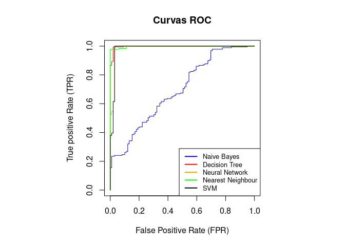

<!-- Importing Libraries -->
---


<!-- Custom Header -->
---
<div style="margin-top: 50px;"></div>

<h1 style="text-align: center; font-size: 36px; font-family: Arial, sans-serif; color: #2c3e50;">
    <strong>Entrega B: R - Evaluación de Modelos</strong>
</h1>
<p style="text-align: center; font-size: 18px; font-family: Arial;">
    <strong>Andrés García-Serra Romero</strong> <br>
    <strong>Ciencia de Datos</strong>
</p>

<!-- 0. Introduccion -->
---
<div style="margin-top: 20px;"></div>
<h1 style="font-size: 24px; font-family: Arial, sans-serif; color: #2c3e50;">
    <strong> Introducción</strong>
</h1>

En este trabajo aplicaremos los conocimientos aprendidos en evaluación de diferentes tipos de clasificadores de datos en la tarea de predicción de si un indivíduo ha ganado o no una partida de tres en raya, utilizando como datos de input la distribución del tablero de la partida. Para realizar la práctica hemos utilizado el software RStudio, creando un proyecto del tipo Markdown notebook. Utilizando el paquete *caret* de *R* entrenaremos cuatro modelos: Un Naive Bayes, un modelo de Árboles de Decisión, una Red Neuronal, uno de Nearest Neighbours y finalmente un SVM con kernel lineal. Estos modelos serán entrenados todos usando Cross-Validation y los mismos sets de entrenamiento y evaluación, dividiendo el set total de datos al 70/30 respectivamente.

Explicaremos en primer lugar cómo hemos llevado a cabo la división del set global de datos manteniendo la proporción de clases y comprobando que todos los datos sean correctos. Seguidamente entrenaremos los modelos, mostrando las métricas de entrenamiento de cada modelo y evaluaremos los modelos usando el set de evaluación, para lo cual calcularemos distintas métricas (incluyendo el AUC) para comprobar la validez de cada uno de los clasificadores según sus curvas ROC. Finalmente, responderemos las preguntas planteadas en el enunciado de la tarea.


<!-- 1. Importando datos -->
---
<h1 style="font-size: 24px; font-family: Arial, sans-serif; color: #2c3e50;">
    <strong>1. Importar Datos</strong>
</h1>

En primer lugar importaremos el fichero *tic-tac-toe.txt* con los datos en un dataframe, del que cambiaremos los nombres de las columnas para comprender mejor los datos. Para esto tendremos en cuenta de que se trata de un tablero 3x3 en el que las posiciones van desde arriba a la izquierda (*pos1*) hasta debajo a la derecha (*pos9*). Llamaremos *win* al último elemento de cada fila, que recoge la victoria o derrota del jugador "x". Aquí podemos ver un ejemplo para entender mejor la distribución de los datos, siendo un ejemplo aleatorio, no real.


```{=html}
<div style='margin: 40px 0; display: flex; align-items: center; justify-content: space-around;'><div><table style='border-collapse: collapse; text-align: center; transform: scale(0.8);'><tr><td style='border: 1px solid black; width: 50px; height: 50px; font-size: 30px;'>X</td><td style='border: 1px solid black; width: 50px; height: 50px; font-size: 30px;'>X</td><td style='border: 1px solid black; width: 50px; height: 50px; font-size: 30px;'>X</td></tr><tr><td style='border: 1px solid black; width: 50px; height: 50px; font-size: 30px;'>O</td><td style='border: 1px solid black; width: 50px; height: 50px; font-size: 30px;'>X</td><td style='border: 1px solid black; width: 50px; height: 50px; font-size: 30px;'>O</td></tr><tr><td style='border: 1px solid black; width: 50px; height: 50px; font-size: 30px;'>O</td><td style='border: 1px solid black; width: 50px; height: 50px; font-size: 30px;'>O</td><td style='border: 1px solid black; width: 50px; height: 50px; font-size: 30px;'>X</td></tr></table></div><div><table style='border-collapse: collapse; text-align: center; transform: scale(0.8);'><tr><td style='border: 1px solid black; width: 50px; height: 50px;'>pos1</td><td style='border: 1px solid black; width: 50px; height: 50px;'>pos2</td><td style='border: 1px solid black; width: 50px; height: 50px;'>pos3</td></tr><tr><td style='border: 1px solid black; width: 50px; height: 50px;'>pos4</td><td style='border: 1px solid black; width: 50px; height: 50px;'>pos5</td><td style='border: 1px solid black; width: 50px; height: 50px;'>pos6</td></tr><tr><td style='border: 1px solid black; width: 50px; height: 50px;'>pos7</td><td style='border: 1px solid black; width: 50px; height: 50px;'>pos8</td><td style='border: 1px solid black; width: 50px; height: 50px;'>pos9</td></tr></table></div><div><table style='border-collapse: collapse; text-align: center; border: 1px solid black; transform: scale(0.8);'><tr><th style='border: 1px solid black; padding: 10px;'>pos1</th><th style='border: 1px solid black; padding: 10px;'>pos2</th><th style='border: 1px solid black; padding: 10px;'>pos3</th><th style='border: 1px solid black; padding: 10px;'>pos4</th><th style='border: 1px solid black; padding: 10px;'>pos5</th><th style='border: 1px solid black; padding: 10px;'>pos6</th><th style='border: 1px solid black; padding: 10px;'>pos7</th><th style='border: 1px solid black; padding: 10px;'>pos8</th><th style='border: 1px solid black; padding: 10px;'>pos9</th><th style='border: 1px solid black; padding: 10px;'>result</th></tr><tr><td style='border: 1px solid black; padding: 10px;'>X</td><td style='border: 1px solid black; padding: 10px;'>O</td><td style='border: 1px solid black; padding: 10px;'>X</td><td style='border: 1px solid black; padding: 10px;'>X</td><td style='border: 1px solid black; padding: 10px;'>O</td><td style='border: 1px solid black; padding: 10px;'>O</td><td style='border: 1px solid black; padding: 10px;'>O</td><td style='border: 1px solid black; padding: 10px;'>X</td><td style='border: 1px solid black; padding: 10px;'>X</td><td style='border: 1px solid black; padding: 10px;'>positive</td></tr><tr><td style='border: 1px solid black; padding: 10px;'>O</td><td style='border: 1px solid black; padding: 10px;'>X</td><td style='border: 1px solid black; padding: 10px;'>X</td><td style='border: 1px solid black; padding: 10px;'>X</td><td style='border: 1px solid black; padding: 10px;'>X</td><td style='border: 1px solid black; padding: 10px;'>X</td><td style='border: 1px solid black; padding: 10px;'>X</td><td style='border: 1px solid black; padding: 10px;'>X</td><td style='border: 1px solid black; padding: 10px;'>O</td><td style='border: 1px solid black; padding: 10px;'>negative</td></tr><tr><td style='border: 1px solid black; padding: 10px;'>O</td><td style='border: 1px solid black; padding: 10px;'>O</td><td style='border: 1px solid black; padding: 10px;'>O</td><td style='border: 1px solid black; padding: 10px;'>O</td><td style='border: 1px solid black; padding: 10px;'>O</td><td style='border: 1px solid black; padding: 10px;'>X</td><td style='border: 1px solid black; padding: 10px;'>O</td><td style='border: 1px solid black; padding: 10px;'>X</td><td style='border: 1px solid black; padding: 10px;'>X</td><td style='border: 1px solid black; padding: 10px;'>negative</td></tr><tr><td style='border: 1px solid black; padding: 10px;'>O</td><td style='border: 1px solid black; padding: 10px;'>X</td><td style='border: 1px solid black; padding: 10px;'>X</td><td style='border: 1px solid black; padding: 10px;'>O</td><td style='border: 1px solid black; padding: 10px;'>X</td><td style='border: 1px solid black; padding: 10px;'>X</td><td style='border: 1px solid black; padding: 10px;'>O</td><td style='border: 1px solid black; padding: 10px;'>O</td><td style='border: 1px solid black; padding: 10px;'>X</td><td style='border: 1px solid black; padding: 10px;'>positive</td></tr><tr><td style='border: 1px solid black; padding: 10px;'>X</td><td style='border: 1px solid black; padding: 10px;'>X</td><td style='border: 1px solid black; padding: 10px;'>X</td><td style='border: 1px solid black; padding: 10px;'>X</td><td style='border: 1px solid black; padding: 10px;'>O</td><td style='border: 1px solid black; padding: 10px;'>X</td><td style='border: 1px solid black; padding: 10px;'>X</td><td style='border: 1px solid black; padding: 10px;'>X</td><td style='border: 1px solid black; padding: 10px;'>X</td><td style='border: 1px solid black; padding: 10px;'>negative</td></tr><tr><td style='border: 1px solid black; padding: 10px;' colspan='10'>...</td></tr></table></div></div>
```
Para el caso real, podemos generar una tabla que recoge las primeras 6 filas de nuestro dataframe ya modificado.


``` r
tictac <- data.frame(read.csv("tic-tac-toe.txt"))
header <- c("pos1","pos2","pos3","pos4","pos5","pos6","pos7","pos8","pos9","win")
colnames(tictac) <- header
head(tictac)
```

<div data-pagedtable="false">
  <script data-pagedtable-source type="application/json">
{"columns":[{"label":[""],"name":["_rn_"],"type":[""],"align":["left"]},{"label":["pos1"],"name":[1],"type":["chr"],"align":["left"]},{"label":["pos2"],"name":[2],"type":["chr"],"align":["left"]},{"label":["pos3"],"name":[3],"type":["chr"],"align":["left"]},{"label":["pos4"],"name":[4],"type":["chr"],"align":["left"]},{"label":["pos5"],"name":[5],"type":["chr"],"align":["left"]},{"label":["pos6"],"name":[6],"type":["chr"],"align":["left"]},{"label":["pos7"],"name":[7],"type":["chr"],"align":["left"]},{"label":["pos8"],"name":[8],"type":["chr"],"align":["left"]},{"label":["pos9"],"name":[9],"type":["chr"],"align":["left"]},{"label":["win"],"name":[10],"type":["chr"],"align":["left"]}],"data":[{"1":"x","2":"x","3":"x","4":"x","5":"o","6":"o","7":"o","8":"x","9":"o","10":"positive","_rn_":"1"},{"1":"x","2":"x","3":"x","4":"x","5":"o","6":"o","7":"o","8":"o","9":"x","10":"positive","_rn_":"2"},{"1":"x","2":"x","3":"x","4":"x","5":"o","6":"o","7":"o","8":"b","9":"b","10":"positive","_rn_":"3"},{"1":"x","2":"x","3":"x","4":"x","5":"o","6":"o","7":"b","8":"o","9":"b","10":"positive","_rn_":"4"},{"1":"x","2":"x","3":"x","4":"x","5":"o","6":"o","7":"b","8":"b","9":"o","10":"positive","_rn_":"5"},{"1":"x","2":"x","3":"x","4":"x","5":"o","6":"b","7":"o","8":"o","9":"b","10":"positive","_rn_":"6"}],"options":{"columns":{"min":{},"max":[10]},"rows":{"min":[10],"max":[10]},"pages":{}}}
  </script>
</div>

<div style="margin-top: 20px;"></div>
Como último paso dentro del input de datos, analizamos en busca de valores vacíos, NaNs o valores que no sean los deseados, es decir: "x", "o" o "b" entre los componentes de posición y "positive" o "negative" en el último elemento de cada fila.


``` r
any(is.na(tictac))
values <- c("x", "o", "b","positive", "negative")
any(!as.matrix(tictac[, 1:9]) %in% values[1:3])
any(!tictac[, 10] %in% values[4:5])
```

```
## [1] FALSE
## [1] FALSE
## [1] FALSE
```

<div style="margin-top: 20px;"></div>
Podemos ver que el output de estas tres comprobaciones nos da un valor booleano "FALSE", indicando que no existen valores NaN, vacíos o diferentes a los esperados.

<!-- 2. Data Splitting -->
---
<div style="margin-top: 20px;"></div>
<h1 style="font-size: 24px; font-family: Arial, sans-serif; color: #2c3e50;">
    <strong>2. Data Splitting</strong>
</h1>

Usando el paquete *caret*, dividimos el dataset en 70% training y 30% test.


``` r
set.seed(123)
train_pos <- createDataPartition(tictac$win, p = .7, 
                                  list = FALSE, 
                                  times = 1)
tictac_train <- tictac[ train_pos,]
tictac_test  <- tictac[-train_pos,]
```

<div style="margin-top: 20px;"></div>
Además, comprobamos dos cosas, la primera es que realmente se hayan dividido correctamente y el cociente entre la cantidad de datos para entrenamiento y validación sea igual o muy cercano a 7/3. La segunda es que la proporción de clases ("positive" y "negative") para los nuevos sets de datos sigan el mismo ratio que en el dataset original.


``` r
# Ratio entre el Set de Entrenamiento y el de Evaluación respecto a 7/3
test_train_ratio <- data.frame(
  Name = c("Sets Size Ratio to 7/3"),
  value = dim(tictac_train)[1]/dim(tictac_test)[1] / (7/3)
)
kable(test_train_ratio, format = "html") %>%
  kable_styling(full_width = FALSE, bootstrap_options = c("striped", "hover"))

# Ratios de Positivos/Negativos para cada set
sets <- data.frame(
  Set = c("Pos/Neg Ratio"),
  Full_Dataset = c(sum(tictac[,10]=="positive")/sum(tictac[,10]=="negative")),
  Training_Set = c(sum(tictac_train[,10]=="positive")/sum(tictac_train[,10]=="negative")),
  Validation_Set = c(sum(tictac_test[,10]=="positive")/sum(tictac_test[,10]=="negative"))
)
kable(sets, col.names = c("", "Full Dataset", "Training Set", "Validation Set"), format = "html") %>%
  kable_styling(full_width = FALSE, bootstrap_options = c("striped", "hover"))
```

<table class="table table-striped table-hover" style="color: black; width: auto !important; margin-left: auto; margin-right: auto;">
 <thead>
  <tr>
   <th style="text-align:left;"> Name </th>
   <th style="text-align:right;"> value </th>
  </tr>
 </thead>
<tbody>
  <tr>
   <td style="text-align:left;"> Sets Size Ratio to 7/3 </td>
   <td style="text-align:right;"> 1.005494 </td>
  </tr>
</tbody>
</table>

<table class="table table-striped table-hover" style="color: black; width: auto !important; margin-left: auto; margin-right: auto;">
 <thead>
  <tr>
   <th style="text-align:left;">  </th>
   <th style="text-align:right;"> Full Dataset </th>
   <th style="text-align:right;"> Training Set </th>
   <th style="text-align:right;"> Validation Set </th>
  </tr>
 </thead>
<tbody>
  <tr>
   <td style="text-align:left;"> Pos/Neg Ratio </td>
   <td style="text-align:right;"> 1.88253 </td>
   <td style="text-align:right;"> 1.879828 </td>
   <td style="text-align:right;"> 1.888889 </td>
  </tr>
</tbody>
</table>

<div style="margin-top: 20px;"></div>
Como podemos ver, tanto la proporción de datos entre los datasets como el ratio de clases cumplen nuestras espectativas, siendo esta segunda comprobación casi idéntica para los tres datasets, el global y los dos nuevos de entrenamiento y validación.

<!-- 3. Generación de modelos -->
---
<div style="margin-top: 20px;"></div>
<h1 style="font-size: 24px; font-family: Arial, sans-serif; color: #2c3e50;">
    <strong>3. Generación de Modelos</strong>
</h1>

Utilizando nuestro nuevo dataset de entrenamiento podemos generar los 5 modelos deseados, que tras una búsqueda en la documentación del paquete
*caret* serán el *'nb'* (Naive Bayes), *'C5.0'* (Decision Tree), *'nnet'* (Neural Network), *'knn'* (Nearest Neighbour) y por último el *'svmLinear2'* (SVM con kernel lineal). 

Nos aseguramos que los entrenamientos se llevan a cabo utilizando validación cruzada de 10 folds y que nuestros clasificadores ya entrenados también sean evaluados como soft en este mismo proceso de entrenamiento, para más tarde utilizar esta propiedad para poder representar las curvas ROC y hallar la AUC de cada clasificador.


``` r
fitControl <- trainControl(
  method = "cv",     # validacion cruzada
  number = 10,       # numero de folds
  classProbs = TRUE
)

set.seed(123)
models <- list(
  nb_train <- train(win ~ ., data = tictac_train, method = "nb", trControl = fitControl),
  dt_train <- train(win ~ ., data = tictac_train, method = "C5.0", trControl = fitControl),
  nn_train <- train(win ~ ., data = tictac_train, method = "nnet", trControl = fitControl),
  knn_train <- train(win ~ ., data = tictac_train, method = "knn", trControl = fitControl),
  SVM_train <- train(win ~ ., data = tictac_train, method = "svmLinear2", trControl = fitControl)
)

results <- bind_rows(lapply(models, function(model) {
  data.frame(
    Accuracy = max(model$results$Accuracy),  # Mejor accuracy
    Kappa = max(model$results$Kappa)         # Mejor kappa
  )
}))

Models <- c('Naive Bayes','Decision Tree','Neural Network','Nearest Neighbour','SVM')
results <- cbind(Models, results)
```

<div style="margin-top: 20px;"></div>
En la siguiente tabla representamos los valores de Accuracy y Kappa del entrenamiento de cada uno de los modelos. Vemos como para el dataset de entrenamiento el modelo que mejores valores de estas métricas da es el Decision Tree, seguido de cerca por el de Red Neuronal y SVM. Estos últimos dos modelos tienen un valor de accuracy idéntico, dando a entender que debido a la simplicidad de los datos y que estamos usando un modelo simple de red neuronal, ambos modelos habrán encontrado una solución muy similar para dividir las dos clases.

Por último queda destacar el mal desempeño del modelo de Naive Bayes, cuyas métricas están muy por debajo del resto de modelos. Esto puede deberse a varias causas, pero la más probable es la correlación de las variables, las cuales el modelo Naive Bayes asume independientes por naturaleza, pero en este ejemplo claramente no lo son.

<table class="table table-striped table-hover" style="color: black; width: auto !important; margin-left: auto; margin-right: auto;">
 <thead>
  <tr>
   <th style="text-align:left;"> Models </th>
   <th style="text-align:right;"> Accuracy </th>
   <th style="text-align:right;"> Kappa </th>
  </tr>
 </thead>
<tbody>
  <tr>
   <td style="text-align:left;"> Naive Bayes </td>
   <td style="text-align:right;"> 0.6960365 </td>
   <td style="text-align:right;"> 0.3211960 </td>
  </tr>
  <tr>
   <td style="text-align:left;"> Decision Tree </td>
   <td style="text-align:right;"> 0.9836479 </td>
   <td style="text-align:right;"> 0.9633842 </td>
  </tr>
  <tr>
   <td style="text-align:left;"> Neural Network </td>
   <td style="text-align:right;"> 0.9820663 </td>
   <td style="text-align:right;"> 0.9596858 </td>
  </tr>
  <tr>
   <td style="text-align:left;"> Nearest Neighbour </td>
   <td style="text-align:right;"> 0.9209787 </td>
   <td style="text-align:right;"> 0.8204810 </td>
  </tr>
  <tr>
   <td style="text-align:left;"> SVM </td>
   <td style="text-align:right;"> 0.9807500 </td>
   <td style="text-align:right;"> 0.9565943 </td>
  </tr>
</tbody>
</table>

<!-- 4. Rendimiento de modelos -->
---
<div style="margin-top: 20px;"></div>
<h1 style="font-size: 24px; font-family: Arial, sans-serif; color: #2c3e50;">
    <strong>4. Rendimiento de modelos</strong>
</h1>

Una vez tenemos los modelos correctamente entrenados, podemos aplicarlos a nuestro dataset de validación para ver cuál es su desempeño. Para esto utilizaremos la rutina *predict*. En primer lugar, como ejemplo podemos observar la matriz de confusión del modelo de Red Neuronal, en el que podemos ver que acierta todos los valores negativos, que son minoría, fallando únicamente 3 clases que predice como positivas y son realmente negativas. Este es un muy bien desempeño, como también podemos ver en las diferentes métricas.


``` r
nn_pred <- predict(nn_train,tictac_test)
nn_matrix <- confusionMatrix(nn_pred,factor(tictac_test$win))
nn_eval <- postResample(nn_pred,factor(tictac_test$win))
nn_matrix
```

```
## Confusion Matrix and Statistics
## 
##           Reference
## Prediction negative positive
##   negative       96        1
##   positive        3      186
##                                           
##                Accuracy : 0.986           
##                  95% CI : (0.9646, 0.9962)
##     No Information Rate : 0.6538          
##     P-Value [Acc > NIR] : <2e-16          
##                                           
##                   Kappa : 0.969           
##                                           
##  Mcnemar's Test P-Value : 0.6171          
##                                           
##             Sensitivity : 0.9697          
##             Specificity : 0.9947          
##          Pos Pred Value : 0.9897          
##          Neg Pred Value : 0.9841          
##              Prevalence : 0.3462          
##          Detection Rate : 0.3357          
##    Detection Prevalence : 0.3392          
##       Balanced Accuracy : 0.9822          
##                                           
##        'Positive' Class : negative        
## 
```

Podemos mostrar también la matriz de confusión del resto de modelos. Para hacer este proceso más visual nos apoyamos en *gpt-4o* y obtenemos una visual más clara de todas las matrices.


```{=html}
<div style='display: grid; grid-template-columns: repeat(5, 1fr); gap: 20px; justify-items: center;'>
     <style>
       table { width: 150px; }  /* Make tables wider */
       caption { font-size: 14px; font-weight: bold; text-align: center; } /* Center titles */
     </style> <table class="table table-striped table-hover table-condensed table" style="font-size: 12px; color: black; width: auto !important; margin-left: auto; margin-right: auto; color: black; width: auto !important; margin-left: auto; margin-right: auto;">
<caption style="font-size: initial !important;">Naive Bayes</caption>
 <thead>
<tr>
<th style="empty-cells: hide;border-bottom:hidden;" colspan="1"></th>
<th style="border-bottom:hidden;padding-bottom:0; padding-left:3px;padding-right:3px;text-align: center; " colspan="2"><div style="border-bottom: 1px solid #ddd; padding-bottom: 5px; ">Actual</div></th>
</tr>
  <tr>
   <th style="text-align:center;position: sticky; top:0; background-color: #FFFFFF;"> Predicted </th>
   <th style="text-align:center;position: sticky; top:0; background-color: #FFFFFF;"> - </th>
   <th style="text-align:center;position: sticky; top:0; background-color: #FFFFFF;"> + </th>
  </tr>
 </thead>
<tbody>
  <tr>
   <td style="text-align:center;"> - </td>
   <td style="text-align:center;"> 6 </td>
   <td style="text-align:center;"> 1 </td>
  </tr>
  <tr>
   <td style="text-align:center;border-bottom: 1px solid #ddd;"> + </td>
   <td style="text-align:center;border-bottom: 1px solid #ddd;"> 93 </td>
   <td style="text-align:center;border-bottom: 1px solid #ddd;"> 186 </td>
  </tr>
</tbody>
</table><table class="table table-striped table-hover table-condensed table" style="font-size: 12px; color: black; width: auto !important; margin-left: auto; margin-right: auto; color: black; width: auto !important; margin-left: auto; margin-right: auto;">
<caption style="font-size: initial !important;">Decision Tree</caption>
 <thead>
<tr>
<th style="empty-cells: hide;border-bottom:hidden;" colspan="1"></th>
<th style="border-bottom:hidden;padding-bottom:0; padding-left:3px;padding-right:3px;text-align: center; " colspan="2"><div style="border-bottom: 1px solid #ddd; padding-bottom: 5px; ">Actual</div></th>
</tr>
  <tr>
   <th style="text-align:center;position: sticky; top:0; background-color: #FFFFFF;"> Predicted </th>
   <th style="text-align:center;position: sticky; top:0; background-color: #FFFFFF;"> - </th>
   <th style="text-align:center;position: sticky; top:0; background-color: #FFFFFF;"> + </th>
  </tr>
 </thead>
<tbody>
  <tr>
   <td style="text-align:center;"> - </td>
   <td style="text-align:center;"> 96 </td>
   <td style="text-align:center;"> 1 </td>
  </tr>
  <tr>
   <td style="text-align:center;border-bottom: 1px solid #ddd;"> + </td>
   <td style="text-align:center;border-bottom: 1px solid #ddd;"> 3 </td>
   <td style="text-align:center;border-bottom: 1px solid #ddd;"> 186 </td>
  </tr>
</tbody>
</table><table class="table table-striped table-hover table-condensed table" style="font-size: 12px; color: black; width: auto !important; margin-left: auto; margin-right: auto; color: black; width: auto !important; margin-left: auto; margin-right: auto;">
<caption style="font-size: initial !important;">Neural Network</caption>
 <thead>
<tr>
<th style="empty-cells: hide;border-bottom:hidden;" colspan="1"></th>
<th style="border-bottom:hidden;padding-bottom:0; padding-left:3px;padding-right:3px;text-align: center; " colspan="2"><div style="border-bottom: 1px solid #ddd; padding-bottom: 5px; ">Actual</div></th>
</tr>
  <tr>
   <th style="text-align:center;position: sticky; top:0; background-color: #FFFFFF;"> Predicted </th>
   <th style="text-align:center;position: sticky; top:0; background-color: #FFFFFF;"> - </th>
   <th style="text-align:center;position: sticky; top:0; background-color: #FFFFFF;"> + </th>
  </tr>
 </thead>
<tbody>
  <tr>
   <td style="text-align:center;"> - </td>
   <td style="text-align:center;"> 96 </td>
   <td style="text-align:center;"> 1 </td>
  </tr>
  <tr>
   <td style="text-align:center;border-bottom: 1px solid #ddd;"> + </td>
   <td style="text-align:center;border-bottom: 1px solid #ddd;"> 3 </td>
   <td style="text-align:center;border-bottom: 1px solid #ddd;"> 186 </td>
  </tr>
</tbody>
</table><table class="table table-striped table-hover table-condensed table" style="font-size: 12px; color: black; width: auto !important; margin-left: auto; margin-right: auto; color: black; width: auto !important; margin-left: auto; margin-right: auto;">
<caption style="font-size: initial !important;">KNN</caption>
 <thead>
<tr>
<th style="empty-cells: hide;border-bottom:hidden;" colspan="1"></th>
<th style="border-bottom:hidden;padding-bottom:0; padding-left:3px;padding-right:3px;text-align: center; " colspan="2"><div style="border-bottom: 1px solid #ddd; padding-bottom: 5px; ">Actual</div></th>
</tr>
  <tr>
   <th style="text-align:center;position: sticky; top:0; background-color: #FFFFFF;"> Predicted </th>
   <th style="text-align:center;position: sticky; top:0; background-color: #FFFFFF;"> - </th>
   <th style="text-align:center;position: sticky; top:0; background-color: #FFFFFF;"> + </th>
  </tr>
 </thead>
<tbody>
  <tr>
   <td style="text-align:center;"> - </td>
   <td style="text-align:center;"> 88 </td>
   <td style="text-align:center;"> 2 </td>
  </tr>
  <tr>
   <td style="text-align:center;border-bottom: 1px solid #ddd;"> + </td>
   <td style="text-align:center;border-bottom: 1px solid #ddd;"> 11 </td>
   <td style="text-align:center;border-bottom: 1px solid #ddd;"> 185 </td>
  </tr>
</tbody>
</table><table class="table table-striped table-hover table-condensed table" style="font-size: 12px; color: black; width: auto !important; margin-left: auto; margin-right: auto; color: black; width: auto !important; margin-left: auto; margin-right: auto;">
<caption style="font-size: initial !important;">SVM</caption>
 <thead>
<tr>
<th style="empty-cells: hide;border-bottom:hidden;" colspan="1"></th>
<th style="border-bottom:hidden;padding-bottom:0; padding-left:3px;padding-right:3px;text-align: center; " colspan="2"><div style="border-bottom: 1px solid #ddd; padding-bottom: 5px; ">Actual</div></th>
</tr>
  <tr>
   <th style="text-align:center;position: sticky; top:0; background-color: #FFFFFF;"> Predicted </th>
   <th style="text-align:center;position: sticky; top:0; background-color: #FFFFFF;"> - </th>
   <th style="text-align:center;position: sticky; top:0; background-color: #FFFFFF;"> + </th>
  </tr>
 </thead>
<tbody>
  <tr>
   <td style="text-align:center;"> - </td>
   <td style="text-align:center;"> 96 </td>
   <td style="text-align:center;"> 0 </td>
  </tr>
  <tr>
   <td style="text-align:center;border-bottom: 1px solid #ddd;"> + </td>
   <td style="text-align:center;border-bottom: 1px solid #ddd;"> 3 </td>
   <td style="text-align:center;border-bottom: 1px solid #ddd;"> 187 </td>
  </tr>
</tbody>
</table> </div>
```


Podemos ver cómo los modelos de Decision Tree Neural Network y SVM funcionan prácticamente idénticos, dejando entre 3 y 4 valores clasificados como positivos pero que realmente eran negativos. Esto pude deberse a 4 outliers que no siguen la tendencia general de los datos, por ello se repiten en los 3 modelos, podrían ser distintas predicciones en cada caso pero se trataría de una coincidencia demasiado oportuna. El modelo de Nearest Neighbour sigue la tendencia de estos tres pero con menos porcentaje de aciertos.

También podemos ver cómo el modelo de Naive Bayes predice la gran mayoría de datos (exceptuando 5) en la clase positiva, fallando así todas las clases que realmente eran negativas.

Podemos ahora extraer una tabla de accuracy y kappa de cada modelo aplicado a los datos de evaluación y utilizando el paquete *AUC* podemos incluir en la tabla también el valor de el área bajo la curva ROC (AUC), que podemos calcular si la predicción de la clasificación de los datos de evaluación la hacemos de tipo probabilístico. Esto genera clasificadores soft que dan dos componentes por fila de datos, ofreciendo la probabilidad en tanto por uno de que cada una de las clases sea elegida como correcta en cada caso. Estos clasificadores soft pueden darse como naturales en algunos modelos que tienen la arquitectura correcta, como el de Red Neuronal o el de Naive Bayes, pero para el resto se calculan probabilidades sintéticas para poder observar el comportamiento de las curvas ROC de cada modelo.


``` r
set.seed(123)


nb_prob <- predict(nb_train,tictac_test, type = "prob")
dt_prob <- predict(dt_train,tictac_test, type = "prob")
nn_prob <- predict(nn_train,tictac_test, type = "prob")
knn_prob <- predict(knn_train,tictac_test, type = "prob")
SVM_prob <- predict(SVM_train,tictac_test, type = "prob")


eval <- list(
  nb_eval <- postResample(predict(nb_train,tictac_test),factor(tictac_test$win)),     #Naive Bayes - nb
  dt_eval <- postResample(predict(dt_train,tictac_test),factor(tictac_test$win)),     #Decision Tree - dt
  nn_eval <- postResample(predict(nn_train,tictac_test),factor(tictac_test$win)),     #Neural Network - nn
  knn_eval <- postResample(predict(knn_train,tictac_test),factor(tictac_test$win)),   #Nearest Neighbour - knn
  SVM_eval <- postResample(predict(SVM_train,tictac_test),factor(tictac_test$win))    #SVM (linear kernel) - svm
)

eval_results <- bind_rows(lapply(eval, function(model) {
  data.frame(
    Accuracy = model[[1]],  # Mejor accuracy
    Kappa = model[[2]]      # Mejor kappa
  )
}))

eval_results <- cbind(Models, eval_results)

AUC <- c(
  auc(roc(tictac_test$win, nb_prob[,2])),
  auc(roc(tictac_test$win, dt_prob[,2])),
  auc(roc(tictac_test$win, nn_prob[,2])),
  auc(roc(tictac_test$win, knn_prob[,2])),
  auc(roc(tictac_test$win, SVM_prob[,2]))
)

eval_results <- cbind(eval_results, AUC)

# Mostrar tabla con estilo en HTML
kable(eval_results, format = "html") %>%
  kable_styling(full_width = FALSE, bootstrap_options = c("striped", "hover"))
```

<table class="table table-striped table-hover" style="color: black; width: auto !important; margin-left: auto; margin-right: auto;">
 <thead>
  <tr>
   <th style="text-align:left;"> Models </th>
   <th style="text-align:right;"> Accuracy </th>
   <th style="text-align:right;"> Kappa </th>
   <th style="text-align:right;"> AUC </th>
  </tr>
 </thead>
<tbody>
  <tr>
   <td style="text-align:left;"> Naive Bayes </td>
   <td style="text-align:right;"> 0.6713287 </td>
   <td style="text-align:right;"> 0.0707224 </td>
   <td style="text-align:right;"> 0.6943769 </td>
  </tr>
  <tr>
   <td style="text-align:left;"> Decision Tree </td>
   <td style="text-align:right;"> 0.9860140 </td>
   <td style="text-align:right;"> 0.9689552 </td>
   <td style="text-align:right;"> 0.9971912 </td>
  </tr>
  <tr>
   <td style="text-align:left;"> Neural Network </td>
   <td style="text-align:right;"> 0.9860140 </td>
   <td style="text-align:right;"> 0.9689552 </td>
   <td style="text-align:right;"> 0.9867120 </td>
  </tr>
  <tr>
   <td style="text-align:left;"> Nearest Neighbour </td>
   <td style="text-align:right;"> 0.9545455 </td>
   <td style="text-align:right;"> 0.8973892 </td>
   <td style="text-align:right;"> 0.9978934 </td>
  </tr>
  <tr>
   <td style="text-align:left;"> SVM </td>
   <td style="text-align:right;"> 0.9895105 </td>
   <td style="text-align:right;"> 0.9766607 </td>
   <td style="text-align:right;"> 0.9837412 </td>
  </tr>
</tbody>
</table>

Vemos como el clasificador que presenta una mejor métrica AUC es el modelo de Árbol de Decisión, presentando un valor muy cercano al clasificador perfecto. Recordemos que esta métrica es importante en el caso de tener que decidir usar un clasificador entre todos cuando no estamos teniendo en cuenta la matriz de costes. En el caso de tener una matriz de costes y hacer un análisis '*cost-sensitive*', tendríamos que fijarnos en la pendiente proveniente de esta matriz de costes y dependería de las diferentes curvas ROC.

Para poder realizar este análisis de curvas ROC podemos representarlas utilizando el paquete *ROCR*.


``` r
  set.seed(123)
  
  nb_pred <- prediction(nb_prob[,2], tictac_test$win)
  dt_pred <- prediction(dt_prob[,2], tictac_test$win)
  nn_pred <- prediction(nn_prob[,2], tictac_test$win)
  knn_pred <- prediction(knn_prob[,2], tictac_test$win)
  SVM_pred <- prediction(SVM_prob[,2], tictac_test$win)
  
  nb_perf <- performance(nb_pred, measure = "tpr", x.measure = "fpr")
  par(pty = "s")
  plot(nb_perf, col = "blue", main = "Curvas ROC", xlab = "False Positive Rate (FPR)",
       ylab = "True positive Rate (TPR)", xlim = c(0, 1), ylim = c(0, 1), asp=1)
  plot(performance(dt_pred, measure = "tpr", x.measure = "fpr"), col = "red", add = TRUE)
  plot(performance(nn_pred, measure = "tpr", x.measure = "fpr"), col = "orange", add = TRUE)
  plot(performance(knn_pred, measure = "tpr", x.measure = "fpr"), col = "green", add = TRUE)
  plot(performance(SVM_pred, measure = "tpr", x.measure = "fpr"), col = "black", add = TRUE)
  legend("bottomright", legend = Models, col = c("blue", "red","orange","green","black"), lwd = 2, cex = 0.8)
```



Podemos ver como la curva ROC del modelo Decision Tree (rojo) muestra un clasificador casi perfecto que servirá muy bien para la mayoría de casos, exceptuando los casos extremos en los que la pendiente proveniente del producto de Hadamard de la matriz de costes tenga valores muy altos o muy pequeños.

Par los casos extremos en los que tengamos una proporción de costes con mucho mayor coste en el falso negativo seguramente el mejor modelo será el de Red Neuronal o SVM con kernel lineal, mientras que para el caso en el que tengamos mucho mayor coste de falsos positivos, es probable que el mejor modelo sea el de Nearest Neighbours.

Es importante por esto considerar el contexto del problema que queremos resolver y entender que la matriz de costes y su análisis es crucial en la toma de decisiones del clasificador a elegir.

<!-- 5. Preguntas -->
---
<div style="margin-top: 20px;"></div>
<h1 style="font-size: 24px; font-family: Arial, sans-serif; color: #2c3e50;">
    <strong>5. Preguntas</strong>
</h1>

<div style="margin-top: 10px;"></div>
<h1 style="font-size: 16px; font-family: Arial, sans-serif; color: #2c3e50;">
    <strong>Q1. ¿Si el modelo A tiene mayor Accuracy que B, siempre tendrá mayor Kappa que B? Justifica tu respuesta
</strong>
</h1>

En un dataset donde la proporción de positivos y negativos es aproximadamente 50%, tendremos que un modelo de accuracy alta generará por lo general también un valor de kappa más alto que un modelo con accuracy baja. Pero en el caso de datasets que presenten una proporción de datos menos equitativa, pueden darse clasificadores que por ejemplo sólo muestren como respuesta una de las clases en la gran mayoría de casos (como es el caso de Naive Bayes en nuestro estudio), dando lugar a una alta Accuracy si la clase clasificada es la dominante en los datos, pero dando lugar a un valor de kappa inferior, puesto que el modelo se muestra similar a un clasificador aleatorio. En este caso un modelo que clasifique los datos de forma más coherente a un caso genérico, es decir, un modelo más robusto, tendrá un valor de accuracy menor, pero mostrará un valor de Kappa mayor al anterior, puesto que distará más de un clasificador aleatorio.

<div style="margin-top: 10px;"></div>
<h1 style="font-size: 16px; font-family: Arial, sans-serif; color: #2c3e50;">
    <strong>Q2. ¿Vemos eso en tus resultados?
</strong>
</h1>

En nuestro caso podemos ver como tenemos unos datos con tendencia hacia la clase positiva:


``` r
prop <- sum(tictac[,10]=="positive")/(sum(tictac[,10]=="positive")+sum(tictac[,10]=="negative"))
print(prop)
```

```
## [1] 0.6530825
```

Teniendo un 65% de casos positivos aproximadamente. En este contexto vemos como el modelo Naive Bayes hace predicciones cercanas al 0.5 de accuracy de un clasificador aleatorio, pero los datos no tienen una proporción tan alta de positivos para que esto sea relevante en el valor de accuracy. Sin embargo podemos ver cómo el valor de accuracy se aproxima mucho a la proporción de positivos, mostrando lo que confirmamos en la matriz de confusión, este modelo predice todos los valores positivos, exceptuando 5 casos.

Si nuestros datos tuvieran una proporción de positivos mucho mayor podría darse el caso en el que el modelo Naive Bayes teniendo un mayor valor de accuracy tendría un valor de kappa muy inferior a modelos con menor accuracy.

<div style="margin-top: 10px;"></div>
<h1 style="font-size: 16px; font-family: Arial, sans-serif; color: #2c3e50;">
    <strong>Q3. ¿Te cambian los resultados cuando cambias la semilla?
</strong>
</h1>

Sí, los resultados cambian al variar la semilla. Esto puede deberse a la poca cantidad de datos, que hace que los subsets de cross-validation puedan tener cierto impacto en el entrenamiento de datos, pese a mantener constante la proporción de positivos y negativos.

<div style="margin-top: 10px;"></div>
<h1 style="font-size: 16px; font-family: Arial, sans-serif; color: #2c3e50;">
    <strong>Q4. ¿Es recomendable quedarse con los resultados mejores después de cambiar las semillas varias veces? Justifica la respuesta.
</strong>
</h1>

Es positivo cambiar el valor del seed para ver como de robusto es nuestro análisis de comparación entre los distintos modelos y como de dependiente es al entrenamiento de estos. SIn embargo, elegir a dedo el mejor seed para representar los resultados que buscamos no es un método que nos dé ningún resultado si lo que buscamos es justamente analizar el desempeño de cada modelo. La respuesta a si es recomendable es un rotundo no.

<div style="margin-top: 10px;"></div>
<h1 style="font-size: 16px; font-family: Arial, sans-serif; color: #2c3e50;">
    <strong>Q5. ¿Qué modelos puedes descartar porque van a ser siempre subóptimos (asumiendo una buena evaluación)?
</strong>
</h1>

Entendiendo como buena evaluación la que tiene suficientes datos de entrenamiento y evaluación para poder realizar afirmaciones sobre la validez de un modelo. Seguramente centraría el análisis de validez de un modelo en revisar las diferentes métricas, poniendo incapié en la matriz de confusión y teniendo siempre en cuenta la variabilidad de mis datos. También valoraría la curva ROC del modelo y el valor de AUC como las métricas más importantes y en el caso de tener una matriz de costes para la aplicación de mi modelo vería cómo desempeña mi modelo para esa matriz de costes concreta, descartandolo por completo si sus errores suponen un coste muy alto.

En nuestro caso concreto, se trata de un ejemplo sencillo con datos simples y con poca variabilidad pero podemos ver claramente como el modelo de Naive Bayes es descartable debido a su modo de predecir siempre la misma clase. Esto tiene un impacto en la matriz de confusión y su curva AUC que se asemeja a la recta que representaría un clasificador aleatorio en una figura FPR-TPR.

<div style="margin-top: 10px;"></div>
<h1 style="font-size: 16px; font-family: Arial, sans-serif; color: #2c3e50;">
    <strong>Q6. ¿Por qué puedes descartar esos modelos?
</strong>
</h1>

Cabe destacar que el descarte de ciertos modelos es siempre debido a la comparación con otros, es decir, si tenemos más modelos para comparar que claramente presentan mejores métricas y sobretodo, mejores curvas ROC para cualquier contexto posible dentro de nuestros datos, los modelos considerados subóptimos serán descartados porque ya hay otros que funcionan mejor de forma genérica. (Entendiendo contexto como matriz de costes y el producto de Hadamard de esta)

<div style="margin-top: 30px;"></div>
